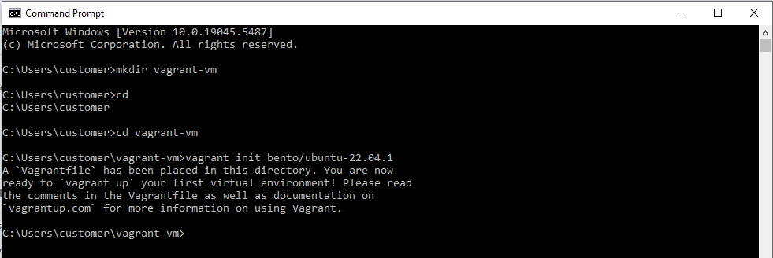
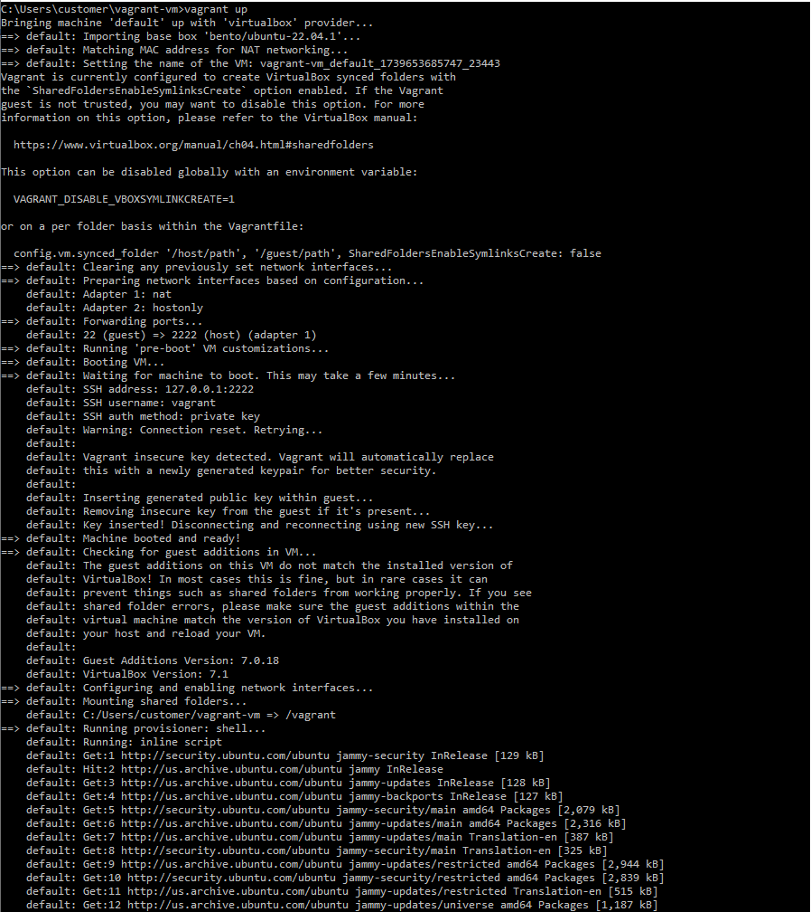
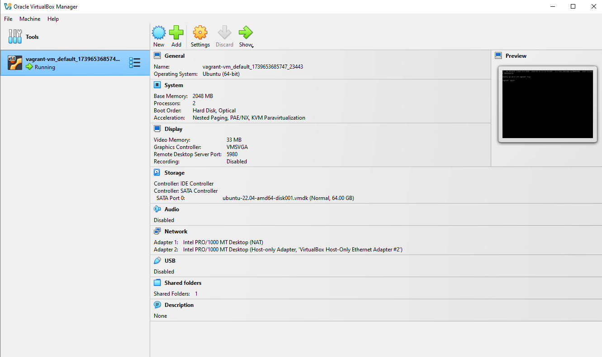
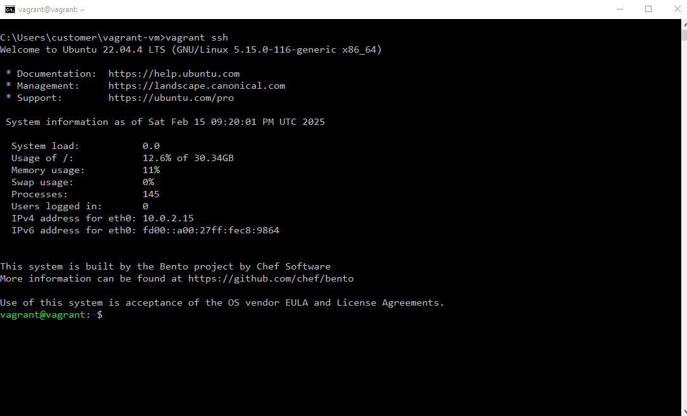
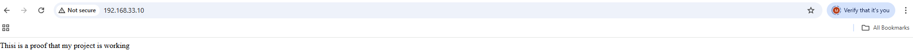

# Step by Step guide in setting up a Virtual Machine with Vagrant and VirtualBox for complete beginners.

## Project Overview:
This project provides a hands-on introduction to setting up a virtual machine (VM) using Vagrant and VirtualBox.  You will configure an Ubuntu 22.04.1 VM and serve a basic web page using Nginx. This type of setup is commonly used for development, testing, and learning purposes.
## What is Vagrant?
Vagrant is an open-source tool that helps developers create and manage virtual environments for software development. It's useful for testing and developing software, especially when working with multiple projects or complex software stacks. 


### Features of Vagrant
*   **Automation:** Speeds up onboarding and eliminates setup errors
*   **Consistency:** Creates reproducible, portable environments that are configured by code
*   **Compatibility:** Works with various virtualization providers, including VirtualBox, VMware, Hyper-V, and Docker
*   **Platform-agnostic:** Runs on macOS, Linux, and Windows

### Benefits of Vagrant
* Simulates production environments so that teams work in sync
* Reduces development environment setup time
* Increases production parity
* Helps avoid the "works on my machine" excuse

---

## What is VirtualBox?

VirtualBox is a powerful, open-source software that lets you run multiple operating systems on a single computer.

VirtualBox is a popular tool among developers, IT professionals, and anyone who needs to work with multiple operating systems. It's free to use and offers a wide range of features, making it a versatile solution for virtualization needs.   

## How Vagrant and VirtualBox Work Together

*   **Vagrant Uses VirtualBox as a Provider:**
    * Vagrant acts as a management tool that sits on top of VirtualBox, allowing developers to easily create, configure, and manage virtual machines using a simple command line interface.
    * While VirtualBox provides the underlying virtualization technology to actually run the virtual machines; essentially, Vagrant simplifies the process of setting up and managing a virtual environment by using VirtualBox as the engine to run it. 
    * Vagrant defines the desired state of a virtual machine through a configuration file (Vagrantfile), specifying the operating system, software packages, and network settings. 


*   **Vagrant Simplifies VirtualBox Usage:**
    * Without Vagrant, you would have to manually configure VMs through the VirtualBox GUI or command line, which can be tedious and error-prone.
    * Vagrant automates this by abstracting away VirtualBox's complexity. For example, setting up networking, provisioning software, or defining VM specifications is done in a simple Vagrantfile.


---

## Prerequisites:
Before starting, ensure you have:

1. ***VirtualBox Installed:**
* Download and install **VirtualBox** [here](https://www.virtualbox.org/)
2. **Vagrant Installed:**
* Download and install **Vagrant** [here](https://developer.hashicorp.com/vagrant/install)
3. **Command-Line Tools:**
*   Access to a terminal or command prompt for running Vagrant commands.

Verify the installations by running:

```
vagrant --version
vboxmanage --version
```

The output should look like this:

```
C:\Users\customer>vagrant --version
Vagrant 2.4.3
C:\Users\customer>vboxmanage --version
7.1.6r167084
```

---
# Step-by-Step Implementation:
## Step 1 - Initialize a Vagrant Project
*   Create a project directory and navigate into it:
```
mkdir vagrant-vm
cd vagrant-vm
```
*    Initialize the Vagrantfile with the Ubuntu 22.04 box:
```
vagrant init bento/ubuntu-22.04.1
```
```bento/ubuntu-22.04.1``` specifies the base image (box) to be used.

The ```vagrant``` init command generates a default Vagrantfile in your project directory

Image 1


## Step 2 - Customize the Vagrantfile
*   Open the Vagrantfile in your text editor and make the following changes:

```
Vagrant.configure("2") do |config|
  # Specify the box
  config.vm.box = "bento/ubuntu-22.04.1"

  # Assign a static IP address
  config.vm.network "private_network", ip: "192.168.33.10"

  # Allocate resources
  config.vm.provider "virtualbox" do |vb|
  
      vb.memory = "2048"
      vb.cpus = 2
end
  
  # Provisionaing script to install Nginx
  config.vm.provision "shell", inline: <<-SHELL
    sudo   apt-get update
    sudo   apt-get install -y nginx
    echo "<h1>This is a proof that my project is working</h1>" | sudo tee /var/www/html/index.html
  SHELL
end


```
**Key Configuration Details::**
*   **Static IP**: ```192.168.33.10``` for easier access from the host. This is useful for testing and development where the VM doesn't need public internet access.
*   **Provisioning**: Runs the provided shell commands during the VM setup. In this case it installs Nginx and serves a custom HTML page.
*   **Resources**: Allocates 2 GB of memory and 2 CPU cores to the virtual machine using the VirtualBox provider.
## Step 3 - Start and Provision the VM
*   Start the VM with:

```
vagrant up
```



This command downloads the box (if it’s not already downloaded), creates the VM, and provisions it as defined in the Vagrantfile.

* Verify from the VirtualBox that the Virtual machine is already running:



* Access the VM:
```
vagrant ssh
```


---

## Step 4 - Test the Web Server
* Open a browser on your host machine and navigate to:

```
http://192.168.56.10
```

You should see the message:

"Welcome to Vagrant VM".



---

Step 5 - Manage the VM

* To stop the VM without deleting it, run:
```
vagrant halt
```

* To remove the VM completely (optional), run:
```
vagrant destroy
```
This will delete all files related to the VM.

---

## Troubleshooting

1. **Vagrant/VirtualBox Compatibility Issues:** Ensure that your versions of Vagrant and VirtualBox are compatible. Update both to the latest versions if necessary.

2. **Permission Issues on Linux:** Use sudo to run commands like vagrant up if you encounter permission errors.

3. **Networking Issues:** Check if the private IP 192.168.33.10 is available. Use a different IP if it conflicts with your network.

---

## Conclusion

In this project, you:

* Learned the basics of Vagrant and VirtualBox.
* Configured a Vagrantfile to automate the creation of a VM.
* Provisioned the VM to serve a basic web page using Nginx.
* Managed the VM lifecycle using Vagrant commands.

This setup forms a strong foundation for exploring more complex environments, including multi-VM setups, shared folders, and advanced provisioning tools.

---

Project Completed!🎉